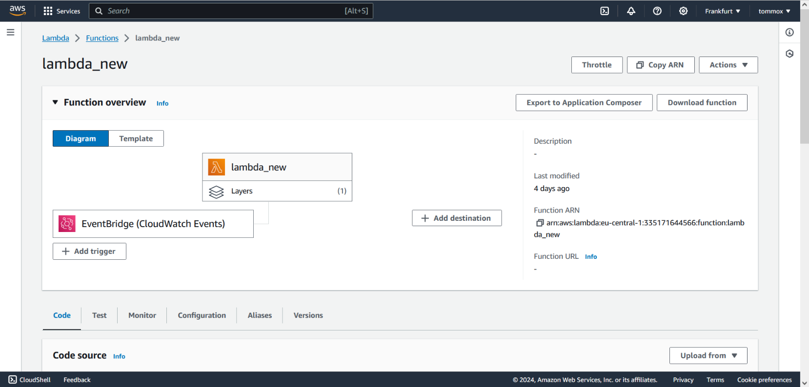
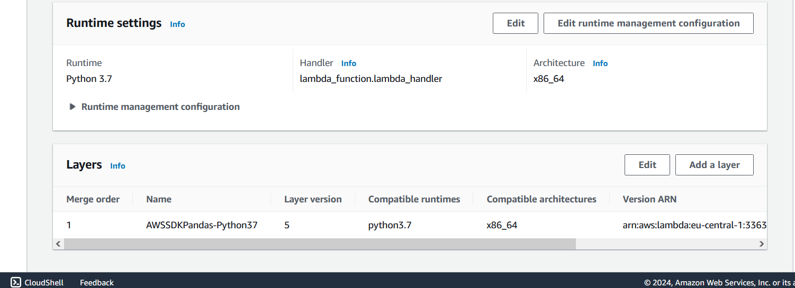
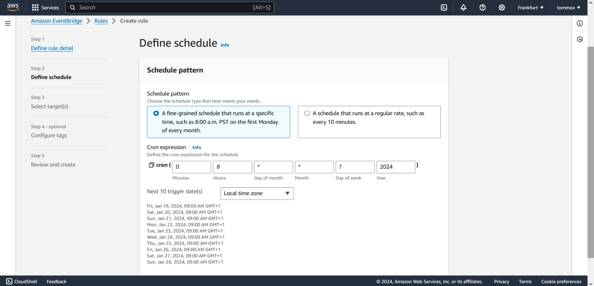
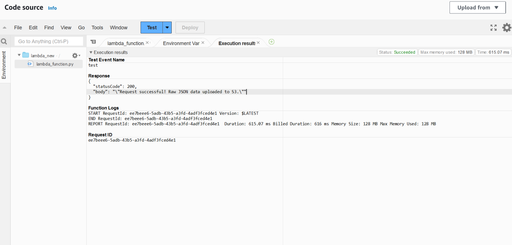
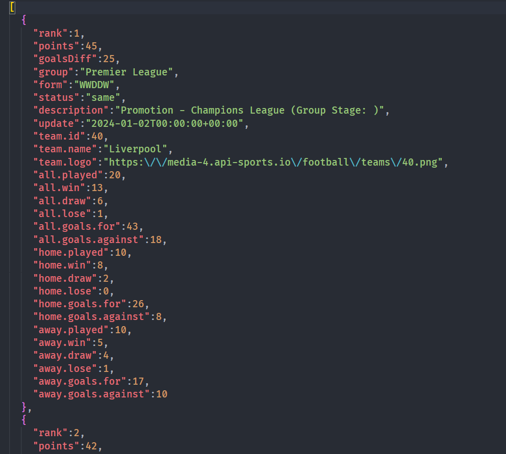
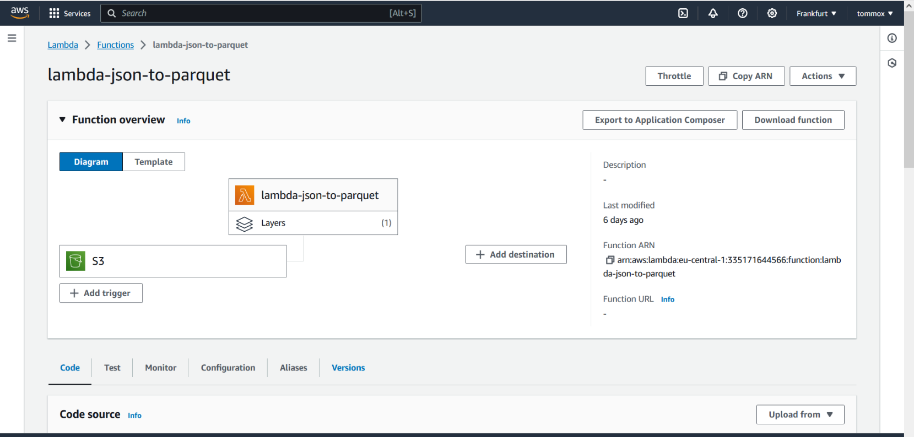
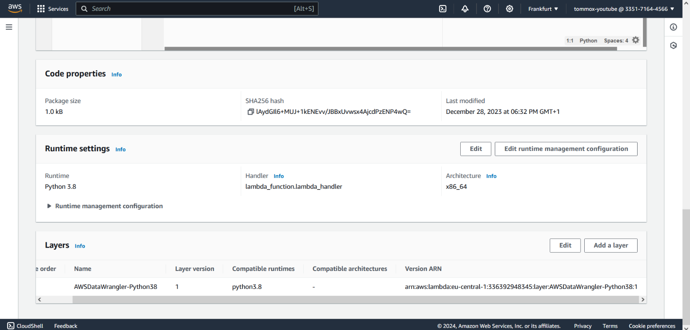
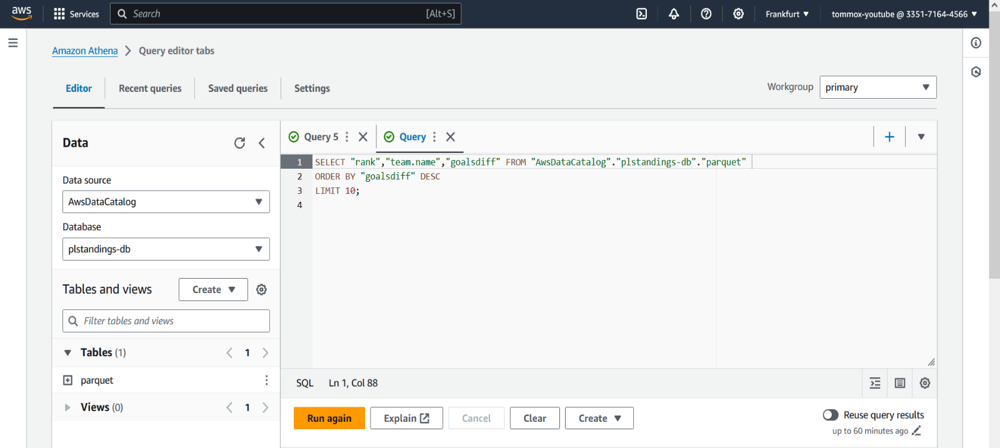
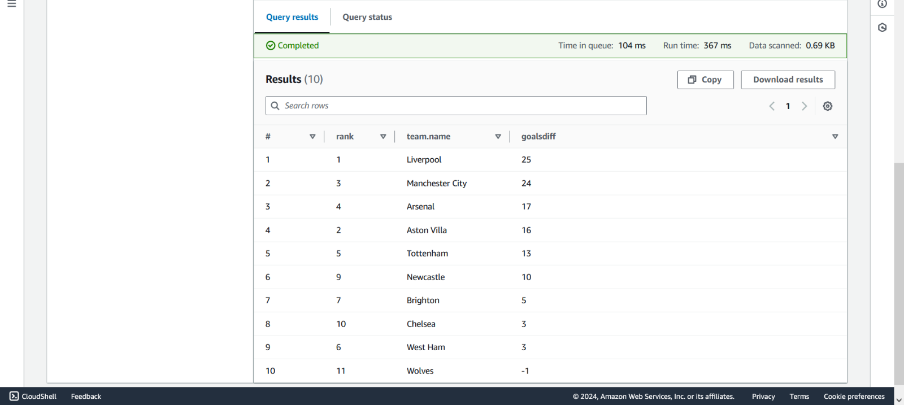
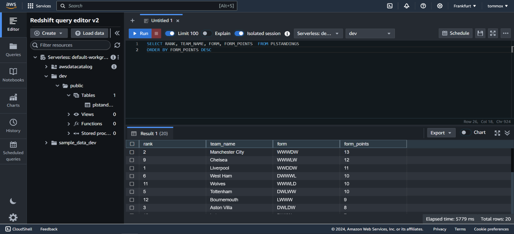

# Project Overview
This project is an ETL (Extract, Transform, Load) pipeline implemented on AWS using Lambda, EventBridge, S3, and Redshift. The pipeline is designed to fetch, transform and store the actual standings of the Premier League from [Football API](https://www.api-football.com/). The process is automated and is working on a scheduled basis.

<br>

# Architecture
In the project, we are implementing a three-stage data lake system. The purpose is to store raw, transformed and final data separately. This method ensures organized and efficient data management across all storage tiers.
 

<br>

# Technologies Used:
- **AWS IAM:** Service that manages user identities and their access to AWS resources.

- **AWS Lambda:** A serverless compute service that lets you run code for virtually any kind of application. It executes code in response to events and automatically manages the computing resources required. 

- **Amazon S3:** An object storage service that provides manufacturing scalability, data availability, security, and performance.

- **AWS Athena:** An interactive query service that makes it easy to query and analyze data directly in Amazon S3 using standard SQL.

- **AWS Redshift:** A fully managed, fast, and scalable data warehouse solution with high performance querying and analytics capabilities.

<br>

# Extract
The first Lambda function in our ETL pipeline, triggered by EventBridge on a predefined schedule, initiates the process by making an API request to the [standings](https://v3.football.api-sports.io/standings) endpoint. It extracts relevant information from the resulting JSON response and then uploads the processed data to **"plstandings-project"** S3 bucket, serving as our raw data landing zone.

<br>

## Configuration
- IAM role required: <u>**AmazonS3FullAccess**</u>
- Adding <u>**AWSSDKPandas-Python**</u> layer that contains the dependencies that can handle JSON format.
- Increasing the timeout duration since the default setting is only 3 seconds. Our function requires about 5 seconds to run.
- Adding the Eventbridge trigger and defining the schedule with Cron expression. In this example the function is going to execute at 9:00 AM every day.


<br>







<br>

### Lambda 1 

```python
import os
import requests
import json
import boto3
from datetime import datetime
import pandas as pd

def lambda_handler(event, context):
    # Access the API key from the environment variables
    api_key = os.environ.get('API_KEY')

    # API endpoint and headers
    url = "https://v3.football.api-sports.io/standings?league=39&season=2023"
    headers = {
        'x-rapidapi-host': "v3.football.api-sports.io",
        'x-rapidapi-key': api_key
        }

    # S3 bucket information
    s3_bucket_name = 'plstandings-project'
    
    # Use timestamp in the filename for unique identification
    timestamp = datetime.now().strftime("%Y%m%d%H%M")  
    s3_object_key = f'raw/plstandings_{timestamp}.json'

     # Make the GET request
    response = requests.get(url, headers=headers)

    # Check if the request was successful (status code 200)
    if response.status_code == 200:
        # Parse the JSON response
        api_response_json = response.json()

        # Extract the relevant part of the JSON response
        extracted_data = api_response_json["response"][0]["league"]["standings"][0]

        # Flatten the nested JSON structure 
        data = pd.json_normalize(extracted_data)

        # Convert DataFrame to JSON string
        json_data = data.to_json(orient='records', indent=2)

        # Upload data to S3
        s3_client = boto3.client('s3')
        s3_client.put_object(Body=json_data, Bucket=s3_bucket_name, Key=s3_object_key)

        return {
            'statusCode': 200,
            'body': 'Request successful! JSON data uploaded to S3.'
        }

    elif response.status_code == 404:
        print("Resource not found. Please check the URL.")

    # Check if the status code is 401 (Unauthorized)
    elif response.status_code == 401:
        print("Unauthorized access. Please check your authentication credentials.")
        
    # Handle the case where the request was not successful (status code is not 200, 404, 401, etc.)
    else:
        print(f"Request failed with status code: {response.status_code}")
        print("Response Text:", response.text)  
```
<br>
<br>

### If we invoke the function manually the response should be the following:


<br>

### The JSON has landed in the raw bucket:


<br>
<br>

### Preview of the JSON file:


<br>

# Transform

If we attempt to query our data with Athena, it results in an error because Athena expects the data to be in a tabular format like Parquet, CSV, etc. In our case we are going to convert the raw data to Parquet using a second Lambda function.

### Configuration

- The Lambda function is configured with an event-based trigger to execute in response to any new file upload to the raw data S3 bucket.

- To convert the file we are using **AWS Data Wrangler** library. It is designed to simplify data engineering tasks like file conversion, reading, writing, and transforming data between different AWS services. To use this library, you need to add the respective layer to the function. For Python 3.8 as runtime you can specify the following ARN: <u>**arn:aws:lambda:<region>:336392948345:layer:AWSDataWrangler-Python38:4** </u>

<br>




<br>

The added timestamp in the filename provides a chronological reference point. By comparing these timestamps, the Lambda function can easily identify and choose the most recently added file to convert. The parquet file is uploaded to **"plstandings-parquet"** bucket.

```python
import boto3
import pandas as pd
import awswrangler as wr

def lambda_handler(event, context):
    # S3 bucket and object information
    s3_bucket_name = 'plstandings-project'
    parquet_bucket_name = 'plstandings-parquet'
    parquet_folder = 'parquet'
    raw_data_folder = 'raw/'

    # Create an S3 client
    s3_client = boto3.client('s3')

    try:
        # List all objects in the raw data folder
        response = s3_client.list_objects_v2(Bucket=s3_bucket_name, Prefix=raw_data_folder)

        # Variables to track the latest timestamp and corresponding file
        latest_timestamp = None
        latest_json_data_key = None

        # Iterate through each object in the raw data folder
        for obj in response.get('Contents', []):
            # Get the key (file path) of the object
            json_data_key = obj['Key']

            # Skip if the object is a folder or not a JSON file
            if not json_data_key.endswith('.json'):
                continue

            # Extract the timestamp from the JSON filename
            timestamp = json_data_key.split('_')[1].split('.')[0]

            # Check if this is the latest timestamp
            if latest_timestamp is None or timestamp > latest_timestamp:
                latest_timestamp = timestamp
                latest_json_data_key = json_data_key

        if latest_json_data_key:
            # Get the JSON data from S3 for the latest file
            response = s3_client.get_object(Bucket=s3_bucket_name, Key=latest_json_data_key)
            json_data = response['Body'].read().decode('utf-8')

            # Create a DataFrame
            df = pd.read_json(json_data)
            
            # Use the timestamp from the JSON filename for the Parquet file
            parquet_data_key = f'{parquet_folder}/plstandings_{latest_timestamp}.parquet'

            # Convert DataFrame to Parquet
            wr.s3.to_parquet(df=df, path=f's3://{parquet_bucket_name}/{parquet_data_key}')

            response_message = "Conversion successful! Parquet data uploaded to S3:"
            print(response_message)
        
        else:
            response_message = "No JSON files found in the specified folder."
            print(response_message)
    
    except Exception as e:
        response_message = f"Error: {e}"
        print(response_message)
    
    return response_message                     
```
<br>
<br>

### Now we can query our data with Athena:



With the third Lambda function in our workflow, we focus on optimizing the raw data for analysis. The transformation involves dropping unnecessary columns, adjusting their order and creating a new column derived from an existing one. We are also changing the periods in column names to underscores to prevent potential syntax issues when working with databases.

The new **form_points** column represents the points earned by a team in its 5 previous matches. It is derived from the existing **form** column, which represents the results as a string of characters like **"WLWWD"**, where "W","L" and "D" indicate wins, losses and draws. The function maps these outcomes to 3, 0 and 1 points respectively and sums them to compute the total points.

The function is triggered by the second S3 bucket when the Parquet file updloaded.

```python
import awswrangler as wr
import pandas as pd
import boto3
from io import BytesIO

def lambda_handler(event, context):
    # S3 bucket and object information
    parquet_bucket_name = 'plstandings-parquet'
    final_bucket_name = 'plstandings-final'
    parquet_folder = 'parquet'
    final_data_folder = 'final'

    s3_client = boto3.client('s3')

    try:
        # List all objects in the parquet data folder
        response = s3_client.list_objects_v2(Bucket=parquet_bucket_name, Prefix=parquet_folder)

        # Variables to track the latest timestamp and corresponding file
        latest_timestamp = None
        latest_parquet_data_key = None

        # Iterate through each object in the raw data folder
        for obj in response.get('Contents', []):
            # Get the key (file path) of the object
            parquet_data_key = obj['Key']

            # Extract the timestamp 
            timestamp = parquet_data_key.split('_')[1].split('.')[0]
            
            # Check if this is the latest timestamp
            if latest_timestamp is None or timestamp > latest_timestamp:
                latest_timestamp = timestamp
                latest_parquet_data_key = parquet_data_key

        if latest_parquet_data_key:
            # Get the Parquet data from S3 for the latest file
            parquet_data_obj = s3_client.get_object(Bucket=parquet_bucket_name, Key=latest_parquet_data_key)

            parquet_data_content = parquet_data_obj['Body'].read()

            # Convert the content to a DataFrame 
            df = pd.read_parquet(BytesIO(parquet_data_content))

            # Create 'form_points' column
            points_mapping = {'W': 3, 'D': 1, 'L': 0}
            calculate_points = lambda form: sum(points_mapping[result] for result in form)
            df['form_points'] = df['form'].apply(calculate_points)

            # Dropping and reordering columns
            new_order = ['rank', 'team.name', 'all.played', 'all.win', 'all.draw', 'all.lose',
                             'all.goals.for', 'all.goals.against', 'goalsDiff', 'points', 'form', 'form_points',
                             'home.played', 'home.win', 'home.draw', 'home.lose', 'home.goals.for', 'home.goals.against',
                             'away.played', 'away.win', 'away.draw', 'away.lose', 'away.goals.for', 'away.goals.against'
                            ]
            df = df[new_order]
            
            # Modify column names with periods to underscores
            df.columns = [col.replace('.', '_') if '.' in col else col for col in df.columns]

            # Upload the transformed DataFrame to S3
            wr.s3.to_parquet(df=df, path=f's3://{final_bucket_name}/{final_data_folder}/finalplstandings_{latest_timestamp}.parquet')

            response_message = "Transformation completed! Data uploaded to S3."
            print(response_message)

        else:
            response_message = "No valid Parquet files found in the specified S3 folder."
            print(response_message)

    except Exception as e:
        response_message = f"Error: {e}"
        print(response_message)

    return response_message
```
<br>

# Load
Concluding our pipeline, we are going to store our final data in Redshift, granting easy access to perform data analysis and queries.

